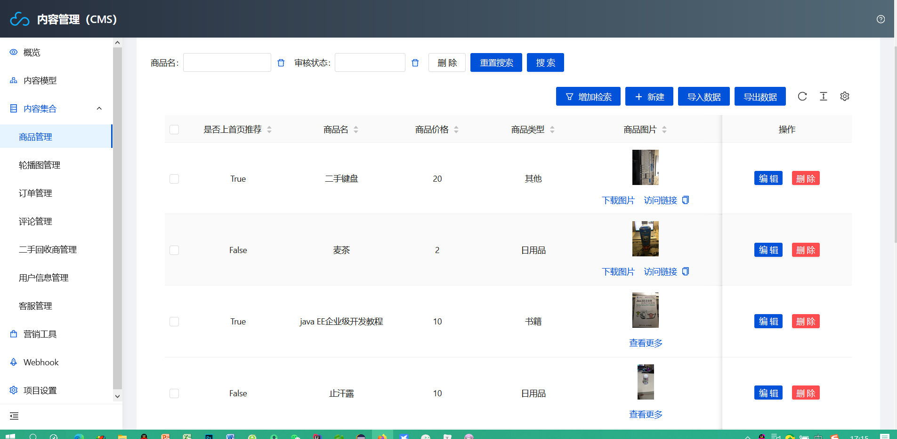

# 小程序云开发校园二手交易平台

技术：采用小程序云开发，后台使用CMS管理后台

# 不懂可以联系我 qq1344612704
#功能介绍
（1）用户登陆：在小程序个人主页点击登录，使用微信API，即可获取用户信息。

（2）游客拦截：在小程序中游客可以浏览商品，但是在购买或者发布时会进行判断，没登录的会跳出登录弹窗。

（3）物品发布：在小程序发布页面，上传商品图片，填写商品各种详细即可发布商品。

（4）我的管理：在我的界面可以对我的订单、我的发布、我的评价等进行管理。

（5）购买管理：在点击选好了后会跳出支付页面，可以对购买的商品就行备注，因为地址调用的是微信的API，在模拟器上运行时只有一个默认地址，需实机操作才可以选择地址，支付弹窗是模拟支付
## 前台功能

### 首页

### 二手物品

### 发布物品

### 我的界面

**我的发布跟我的订单差不多就不截图了**

### 上门回收

### 新品推荐

按时间降序排列，最新发布的在最上面

## 后台功能

采用CMS后台。

### 商品管理

#### 审核商品

#### 是否上首页推荐

### 轮播图管理

可以对首页轮播图进行增删查改

### 订单管理

可以对订单进行修改删除

### 评论管理

可以对评论进行修改删除

### 二手商管理

可以对二手商进行增删查改

### 客服管理

可以对客服进行增删查改

### 用户管理

可以对用户进行禁用，信息修改

# 
